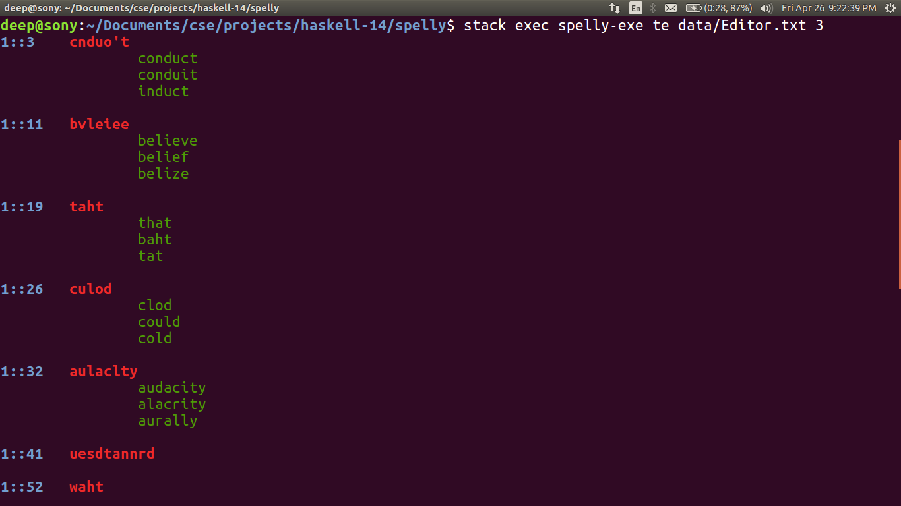

# Spelly

**Contents**

* [Description](#Description)
* [Documentation](#Documentation)
* [Installation](#Installation)
* [Example](#Example)
* [Customizing the Run](#Customizing-the-Run)
* [Software Used](#Software-Used)

## Description
 
 _Spelly_ is a spell suggestor which will take an input file and compare the text with a dictionary and suggest spelling corrections for words which are not found in the dictionary.
 
 .gif)

Team Members:

-     Deep Diwani (EE16BTECH11006)
-     Dhiraj Agarwalla (ES16BTECH11010)
-     Gajanan Shetkar (CS17BTECH11016)
-     Anurag Patil (CS17BTECH11004)

## Documentation
The documentation is done using haddock and can be found [here]().


## Installation

1. Open a new directory and git clone the repository using the following command.
 -``` git clone https://github.com/IITH-SBJoshi/haskell-14.git ```

2. Install stack using the following command (If it is not installed)

 - ```curl -sSL https://get.haskellstack.org/ | sh```

3. Follow the following sequence of commands to run the files.
 
 Run this command in the spelly directory.(which can be opened by _"cd spelly" command_).
 -   ```stack build```
 
 -  ```stack exec spelly-exe t "/pathname/filename.txt"```

 
## Example

1. The program is used on the file [Editor.txt](spelly/data/Editor.txt) by the following steps
 - ```stack build```
 - ```stack exec spelly-exe t /home/ubuntu/Documents/Editor.txt```

2. It gives the following output  


 The number _1::3_  denotes the line number and the character of the mistaken word respectively  
 Following that is the word itself _cnduo't_  
 
  Then the suggested words are given in new lines in decreasing order of frequencies  
 
 - _conduct_  
 - _conduit_  
 - _induct_  
  
 
 
## Customizing the Run
The input of the program can be customized to
-  take custom dictionary (_d_) 
 _The format of the dictionary text file should be_

  word(1) frequency(1)
  word(2) frequency(2)
  ...
  word(n) frequency(n)_
  
  Each word frequency pair should be followed by a linebreak.
  

- change the number of suggestions (_s_)
-  as well as change  the difference (_e_) in the suggested word with the mistaken word (a criterion of Edit-Distance).

Default values are  
- d = data/Frequencies.txt
- s = 3
- e = 2

Following are the eight configurations of command inputs:
1. ```stack exec spelly-exe t </pathname/filename.txt>```

2. ```stack exec spelly-exe td </pathname/filename.txt> </pathname/dictionaryfilename.txt>```

3. ```stack exec spelly-exe tds </pathname/filename.txt> </pathname/dictionaryfilename.txt> <svalue> ```

4. ```stack exec spelly-exe te </pathname/filename.txt> evalue```

5. ```stack exec spelly-exe tde </pathname/filename.txt> </pathname/dictionaryfilename.txt> <evalue>```

6. ```stack exec spelly-exe tdse </pathname/filename.txt> </pathname/dictionaryfilename.txt> <svalue> <evalue>```

7. ```stack exec spelly-exe ts </pathname/filename.txt> <svalue>```

8. ```stack exec spelly-exe tse </pathname/filename.txt> <svalue> <evalue>```


 ## Software Used
 - [Circle CI](https://circleci.com/docs/2.0/language-haskell/) for Continuous Integration and unit testing
 - [Stack](https://docs.haskellstack.org/en/stable/README/) for building the haskell project

## Bibliography
This [algorithm](http://users.monash.edu/~lloyd/tildeStrings/Alignment/92.IPL.html) may be used in  Edit-distance file for better speed. This is given by Llyod Allison ([wiki-link](https://wiki.haskell.org/Edit_distance)).
